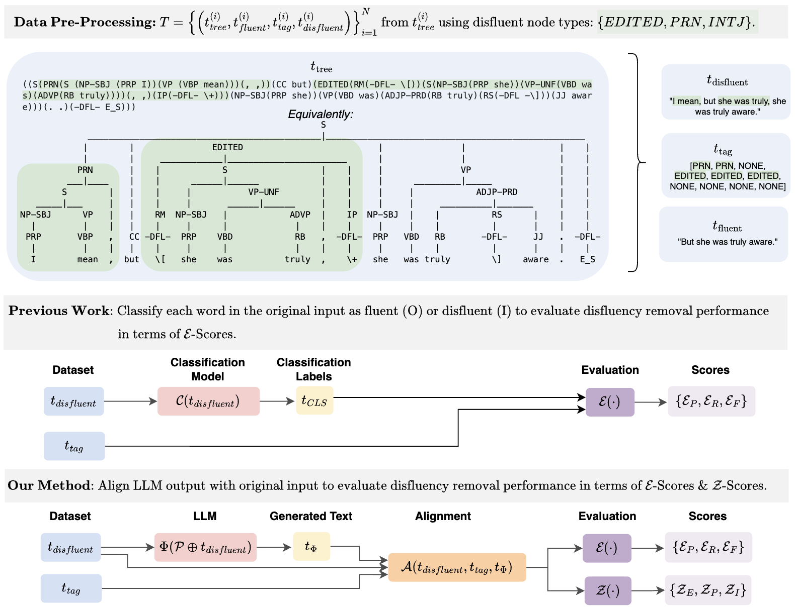

#  Z-Scores: A Metric for Linguistically Assessing Disfluency Removal

## 📖 Overview  
**Z-Score** is a Python package for evaluating **disfluency removal systems** on spontaneous speech. It provides:  

- **Word-Level Metrics (E-Scores):** Precision, Recall, and F1 for disfluency removal  
- **Span-Level Metrics (Z-Scores):** Fine-grained evaluation of how models handle specific disfluency types, **EDITED**, **INTJ**, and **PRN**. 

This framework complements standard token-level metrics by offering interpretability and diagnostics, enabling researchers and practitioners to uncover *why* models succeed or fail and improve targeted modeling efforts.

This code accompanies our paper, *Z-Scores: A Metric for Linguistically Assessing Disfluency Removal*.

## 📦 Installation  

Clone this repository and install it in editable mode:  

```bash
git clone https://github.com/mariateleki/zscore.git
cd zscore
pip install -e .
```

This will install `zscore` and its dependencies locally, allowing you to import and use it in any Python environment.

## ⚡ Quick Start  

### 1. **Add Switchboard data**  
Obtain [**Switchboard (Treebank-3, LDC99T42)**](https://catalog.ldc.upenn.edu/LDC99T42) and place it in `data/treebank_3/`.

### 2. **Prepare Your Input CSV**  
Create a CSV file with two columns:  

| filename | generated-text |
|---------|----------------|
| sw2005.mrg | uh I think we should go now |
| sw3007.mrg | well yeah that sounds good |

- **`filename`**: The reference treebank file ID (e.g., `sw2005.mrg`)  
- **`generated-text`**: The model-generated output to evaluate  

### 2. **Run the Evaluator as a Python Module**  
```python
from zscore.zscore import evaluate_file

evaluate_file("path/to/input.csv")
```

Our package allows you to integrate evaluation directly into your pipeline.

## 📊 Example Output  

| filename | generated-text | e_p | e_r | e_f | z_e | z_i | z_p |
|---------|----------------|-----|-----|-----|-----|-----|-----|
| sw2005.mrg | uh I think we should go now | 0.85 | 0.80 | 0.82 | 0.78 | 0.05 | 0.81 |
| sw3007.mrg | well yeah that sounds good | 0.90 | 0.87 | 0.88 | 0.83 | 0.04 | 0.85 |

## 🖼️ Z-Score Framework  

The figure below illustrates the **Z-Score evaluation pipeline**, including our deterministic alignment module (`A`), which enables both word-level (E-Score) and span-level (Z-Score) evaluation:  

  

## 🧩 Key Features  

- **Deterministic Alignment Module:** Aligns generated outputs with disfluent transcripts for reliable scoring  
- **Category-Aware Metrics:** Breaks down performance across disfluency types (EDITED, INTJ, PRN)  
- **Batch Evaluation Support:** Process entire datasets in a single run  


## 🤝 Contributing 

We welcome contributions! To get started:  

1. **Fork & Clone**  
   ```bash
   git clone https://github.com/<your-username>/zscore.git
   cd zscore
   pip install -e .
   ```  
   This installs `zscore`.

2. **Run Tests**  
   ```bash
    PYTHONPATH=src python -m unittest discover -s tests
   ```  
   Make sure all tests pass before opening a pull request. 

3. **Submitting Changes**  
   - Open a pull request (PR) with a clear description of your changes.  
   - *Include tests for new functionality.*  
   - If you are adding features or modifying behavior, update this README with relevant instructions.  

## 📝 Notes  
- The framework is designed for **research use** and works with Switchboard-style parse trees, but it is generalizable to other corpora.
- We include the metaprompting experiments as part of [DRES]().


## ✨ Citation

If you use this code, please use the following citation:

```bibtex
@inproceedings{teleki2025zscores,
  title={Z-Scores: A Metric for Linguistically Assessing Disfluency Removal},
  author={Teleki, Maria and Janjur, Sai Tejas and Liu, Haoran and Grabner, Oliver and Verma, Ketan and Docog, Thomas and Dong, Xiangjue and Shi, Lingfeng and Wang, Cong and Birkelbach, Stephanie and Kim, Jason and Zhang, Yin and Caverlee, James},
  year={2025},
}
```